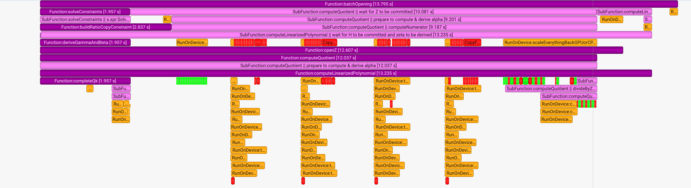

# GPU 加速测试日志

- 测试代码：[wenjin1997/eonark-gpu/tree/wenjin1997/test-from-new](https://github.com/wenjin1997/eonark-gpu/tree/wenjin1997/test-from-new)
- 测试输出日志：[eonark-gpu/logs/gpu-4090](https://github.com/wenjin1997/eonark-gpu/tree/wenjin1997/test-from-new/logs/gpu-4090)
- 测试命令：

```sh
./scripts/run_recursion.sh
```

根据测试日志 [eonark-gpu/logs/gpu-4090](https://github.com/wenjin1997/eonark-gpu/tree/wenjin1997/test-from-new/logs/gpu-4090) 总结测试结果如下：

```sh
==================== Prover Benchmark ====================

[System Info]
  CPU         : Intel Core i9-13900KF (24 cores)
  Memory      : 64 GB
  GPU         : NVIDIA GeForce RTX 4090 (24 GB)
  Driver      : 580.95.05
  CUDA        : 13.0
  Timestamp   : Tue Dec 16 22:48:56 2025

----------------------------------------------------------

[Circuit Info]
  Constraints : 6,312,216  (nbConstraints)

----------------------------------------------------------

[Setup & Prove]
  Setup device               : 887.410342 ms
  Prove total                : 14978.985185 ms

----------------------------------------------------------

[Phase 1] Init blinding polynomial
  Time                        : 0.012948 ms

[Phase 2] Solve constraints
  Total                       : 1956.708584 ms
    - Solve L/R/O              : 1557.707320 ms
    - Set witness values      : 0.019025 ms
    - Commit L/R/O (MSM)      : 398.965199 ms

[Phase 3] Complete Qk polynomial
  Time                        : 1956.105052 ms

[Phase 4] Derive gamma & beta
  Time                        : 1956.796530 ms

[Phase 5] Build ratio polynomial (copy constraints)
  Time                        : 2836.631167 ms

[Phase 6] Compute quotient polynomial (h)
  Total                       : 12037.193112 ms
    - Prepare & derive alpha  : 2850.478715 ms
    - Compute numerator (FFT) : 7211.754267 ms
    - Divide by Z_H (FFT)     : 768.281552 ms
    - Commit quotient (MSM)   : 781.197070 ms
    - Derive zeta & cleanup  : 425.403647 ms

[Phase 7] Open Z polynomial (at ω·ζ)
  Time                        : 12606.983386 ms

[Phase 8] Linearized polynomial
  Total                       : 13234.852576 ms
    - Wait for H & zeta       : 12036.750148 ms
    - Commit linearized (MSM) : 168.380047 ms

[Phase 9] Batch opening
  Time                        : 13794.795561 ms

----------------------------------------------------------

[CPU <-> GPU Communication]
  Total                       : 5478.782515 ms
    - Host → Device (H2D)     : 1768.637462 ms
    - Device → Host (D2H)     : 3710.145053 ms

----------------------------------------------------------

[GPU Execution]
  Run on device total         : 7725.999749 ms

==========================================================
```


其实很多函数会并行运行，打开 [Test_Recursion_20251216_221131.sqlite](https://github.com/wenjin1997/eonark-gpu/blob/wenjin1997/test-from-new/logs/gpu-4090/Test_Recursion_20251216_221131.sqlite) 文件，可以看到函数并行运行的情况：



